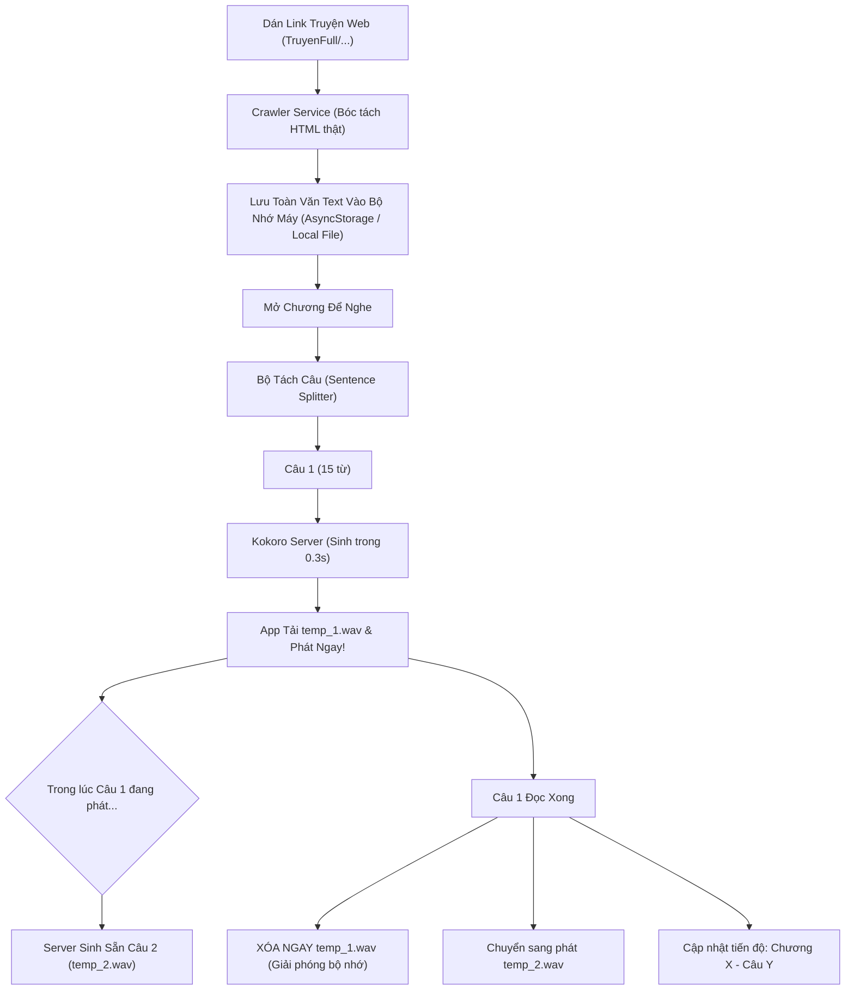

# Kế Hoạch Triển Khai: Bộ Cào Truyện Thật, Ghi Nhớ Tiến Độ & Phát Audio Siêu Nhẹ

## 1. Mục Tiêu & Yêu Cầu Cốt Lõi

1. **Cào truyện thật từ mạng (Live Web Novel Crawler)**:
   - Hỗ trợ lấy toàn văn chương thật từ các website truyện phổ biến (TruyenFull, TangThuVien, DTruyen, Metruyenchu...).
   - Lưu thẳng nội dung văn bản (text) vào máy để đọc/nghe offline không cần cào lại.
   - Text siêu nhẹ: 1 chương ~10KB, cả 100 chương chỉ tốn ~1MB bộ nhớ.

2. **Quản lý Thư viện & Ghi nhớ tiến độ (Progress Tracking & Storage)**:
   - **Ghi nhớ chính xác**: Đang nghe truyện nào, chương bao nhiêu, đến câu/giây thứ mấy.
   - **Tiếp tục nghe (Resume)**: Mở app là có nút "Tiếp tục nghe chương đang dở".
   - **Xóa truyện**: Cho phép người dùng xóa bất kỳ truyện nào khỏi máy để giải phóng dữ liệu.

3. **Audio Engine Siêu Nhẹ & Phát Tức Thì (Zero-Waste Buffer)**:
   - **Bấm Play phát ngay trong 0.3s - 0.5s**: Tách câu (sentence chunking), sinh câu đầu tiên siêu nhanh để loa phát tiếng ngay lập tức.
   - **Nạp gối đầu ngầm (Pre-buffering)**: Trong lúc câu 1 đang phát, câu 2 đã âm thầm sinh xong ở dưới nền.
   - **Đọc xong xóa ngay (Instant Auto-Cleanup)**: Khi câu 1 vừa đọc xong, file audio tạm thời được xóa ngay lập tức khỏi điện thoại (`FileSystem.deleteAsync`). Điện thoại chỉ duy trì tối đa 1 - 2 file tạm nhỏ (~1MB), không bao giờ bị đầy bộ nhớ!

---

## 2. Kiến Trúc & Luồng Dữ Liệu (Architecture)



---

## 3. Chi Tiết Các Hạng Mục Triển Khai

### Hạng Mục 1: Bộ Cào Truyện Thật (`server.py` + `crawlerService.ts`)
- **Backend API `/api/crawl`**:
  - Nhận URL (ví dụ: `https://truyenfull.vn/pham-nhan-tu-tien/chuong-1/`).
  - Gửi HTTP request tải HTML thật với headers giả lập trình duyệt (bỏ qua chặn bot).
  - Sử dụng `BeautifulSoup` bóc tách chính xác:
    - Tiêu đề truyện & Tác giả.
    - Tiêu đề chương & Số chương.
    - Toàn bộ nội dung chữ sạch (lọc bỏ quảng cáo, text mời gọi mua vip, ký tự rác).
    - Đường dẫn chương trước (`prev_url`) và chương sau (`next_url`).
- **Lưu trữ Offline**:
  - Sau khi cào xong, lưu trọn vẹn văn bản vào Storage trên điện thoại.

### Hạng Mục 2: Quản Lý Bộ Nhớ & Ghi Nhớ Tiến Độ (`storageService.ts`)
- **Cấu trúc dữ liệu tiến độ (`ReadingProgress`)**:
  ```typescript
  interface ReadingProgress {
    bookId: string;
    bookTitle: string;
    chapterId: string;
    chapterNumber: number;
    chapterTitle: string;
    sentenceIndex: number;
    positionMs: number;
    totalSentences: number;
    lastListenedAt: number;
  }
  ```
- **Tính năng Thư Viện**:
  - Danh sách truyện đã lưu offline trong máy.
  - Nút **"Tiếp tục nghe"** nổi bật trên đầu trang Home.
  - Nút **"Xóa truyện"** (kèm cảnh báo xác nhận): Xóa toàn bộ nội dung text và tiến độ của cuốn sách đó khỏi máy.

### Hạng Mục 3: Audio Engine Phát Tức Thì & Tự Xóa Sạch (`ttsService.ts`)
- **Thuật toán tách câu thông minh (Sentence Chunking)**:
  - Tách dựa trên dấu chấm (`.`), chấm than (`!`), chấm hỏi (`?`), chấm lửng (`...`), xuống dòng (`\n`).
  - Gom các câu quá ngắn (dưới 5 từ) lại để ngữ điệu đọc không bị giật cục.
- **Cơ chế Dual-Buffer**:
  - `Slot A`: File audio đang phát qua loa.
  - `Slot B`: File audio của câu tiếp theo đang được tải sẵn về máy.
- **Cơ chế Zero-Waste Auto-Delete**:
  - Ngay khi `Slot A` phát xong: gọi lệnh `FileSystem.deleteAsync(slotA.uri)` để xóa vĩnh viễn file khỏi cache.
  - Gán `Slot B` thành đang phát, và bắt đầu tải trước `Slot C` cho câu kế tiếp.
  - Tổng dung lượng bộ nhớ đệm trên điện thoại luôn giữ ở mức **dưới 2MB**.

---

## 4. Kế Hoạch Các Bước Thực Hiện

| Bước | Nội dung công việc | Kết quả đạt được |
| :---: | :--- | :--- |
| **B1** | Bổ sung endpoint `/api/crawl` trong `server.py` bóc tách TruyenFull, TangThuVien... | Cào được chữ thật từ link web |
| **B2** | Viết `storageService.ts` quản lý lưu text, ghi nhớ tiến độ & xóa truyện | Lưu text offline, nhớ chương/câu, xóa truyện |
| **B3** | Nâng cấp `ttsService.ts` với Sentence Chunking + Pre-buffer + Tự xóa audio | Bấm Play là phát trong 0.3s, tự xóa file |
| **B4** | Cập nhật giao diện App (`App.tsx`, `FullPlayerModal.tsx`, `LibraryTab`) | Hiện tiến độ đọc, nút tiếp tục nghe, nút xóa truyện |
| **B5** | Triển khai Server lên Cloud Miễn Phí (Hugging Face Spaces 16GB RAM) | Có link HTTPS online 24/7 nghe qua 4G |
| **B6** | Thử nghiệm thực tế với 1 chương truyện thật trên TruyenFull | Kiểm tra độ mượt, âm thanh và dung lượng máy |

---

## 5. Kế Hoạch Đưa Server Lên Mạng Miễn Phí 100% (Free Cloud Hosting)

Để nghe sách ở bất cứ đâu (kể cả khi tắt máy tính, đi trên xe, bật 4G/5G), chúng ta sẽ đưa backend lên dịch vụ Cloud miễn phí:

### 🏆 Giải Pháp Tốt Nhất: Hugging Face Spaces (CPU Basic - Free 100% Vĩnh Viễn)
* **Thông số miễn phí**: **2 vCPU, 16 GB RAM, 50 GB Ổ cứng** (cấu hình cực mạnh, hoàn toàn không cần nhập thẻ visa/mastercard).
* **Đặc tính**:
  * Được thiết kế chuyên biệt để chạy các mô hình AI mã nguồn mở như Kokoro TTS.
  * Tự động cấp đường dẫn **HTTPS công khai** miễn phí vĩnh viễn (ví dụ: `https://quanghung-kokoro-tts.hf.space`).
  * Uptime 24/7 ổn định, tốc độ mạng quốc tế & Việt Nam cực nhanh.
* **Cách triển khai**:
  1. Tạo một repo `Dockerfile` trên Hugging Face Spaces (chế độ Public hoặc Private miễn phí).
  2. Đóng gói `server.py`, thư viện `kokoro-vietnamese`, mô hình ONNX và các giọng đọc.
  3. Git push lên Hugging Face ➜ Hệ thống tự build và chạy online trong vòng 3 phút!

### 🔄 Tích hợp kép trong App (Hybrid Online / Offline PC):
* Trong App sẽ có cài đặt **Địa chỉ Server**:
  * Mặc định: Điền sẵn link Cloud miễn phí (`https://...hf.space/tts`).
  * Khi ở nhà: Có thể chuyển sang IP nội bộ máy tính (`http://192.168.110.172:3000`) nếu muốn máy tính xử lý.
  * Tự động kiểm tra kết nối để người dùng luôn biết app đang nghe từ server nào.
